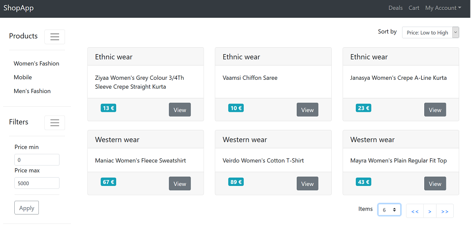

# ShopApp
<div align="center">
    </img>
</div>

####  Back-End
Hypermedia-powered`(HAL)` webservice that exposes REST API  to
- Create a category
- List all categories
- Create an item for a category
- List all items for the category

#### Front-End
`Responsive Single Page Application` that accesses back-end to view the categories and its items with following support
- Select Categories
- Filtering
- Pagination
- Sort by
- Page size

#### Tools Choices
| Framework        | Description|
| ------------- |-------------|
| [Spring Data REST](https://docs.spring.io/spring-data/rest/docs/2.0.0.M1/reference/html/index.html)    | Translates HTTP calls to method calls by mapping the HTTP verbs to CRUD methods. |
|[H2](http://www.h2database.com/html/main.html)     | Embedded in-memory database       |
| [Lombok](https://projectlombok.org/) | To avoid repeating boiler plate getter, settter, equals, hashcode in java |
| [React](https://reactjs.org/) | A JavaScript library for building user interfaces      |
| [reactstrap](https://reactstrap.github.io/) | React native Bootstrap 4 components      |
| [Create React App](https://github.com/facebook/create-react-app) | One Dependency that encapsulates all goodness of React, JSX, ES6, TypeScript, Webpack, Babel, ESLint     |

## Project Setup

#### Back-end
From root directory
```
mvn clean install

Run "ShopApplication.java" from IDE or execute "./mvnw spring-boot:run" from terminal
```

And navigate to http://localhost:8080

##### Note
 During `mvn clean install` the `maven-resources-plugin` will copy static html/js/css build files generated from ./gui/build to target/static/
 to serve as a "Single Page APP" within a webserver[Spring boot's tomcat in this case].

 So there is no need to run separate web-server for fron-end.
 But it is still possible to run both independently.

#### Front-end
`./gui` from the root directory contains all the GUI related files which itself is a functional create-react-app project.
```
cd ./gui

npm install --save  ==> Downloads all node modules locally, will take ~10 mins if first time

npm start ==> Starts a webserver at localhost:3000 and points localhost:8080 for back-end queries

npm run build ==> Generates static production files under /build
```

#### HTTP Verb to CRUD Method Mapping
|Verb |	Method|
|---- |-------|
GET 	|CrudRepository<ID,T>.findOne(ID id)
POST |	CrudRepository<ID,T>.save(T entity)
PUT 	|CrudRepository<ID,T>.save(T entity)
DELETE |	CrudRepository<ID,T>.delete(ID id)

##### Sample Records

`SampleRecordsLoader.java` generates sample mock records to explore the application.


##### Integration tests with decent coverage

Element | Class % | Method% | Line %|
|---- |-------|---- |-------|
exercise	|100% (5/5)|	76% (20/26)|	89% (61/68)|

##### Responsiveness

Tested mostly with [this site](http://responsivedesignchecker.com/)